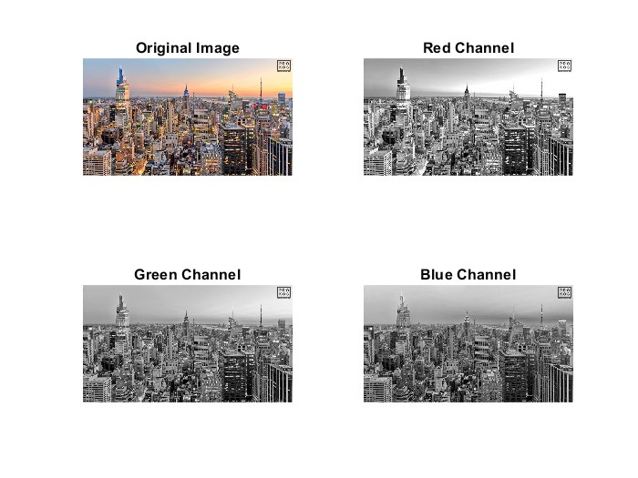
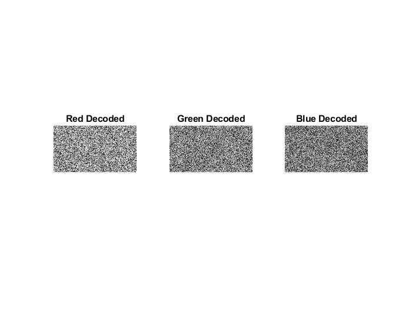
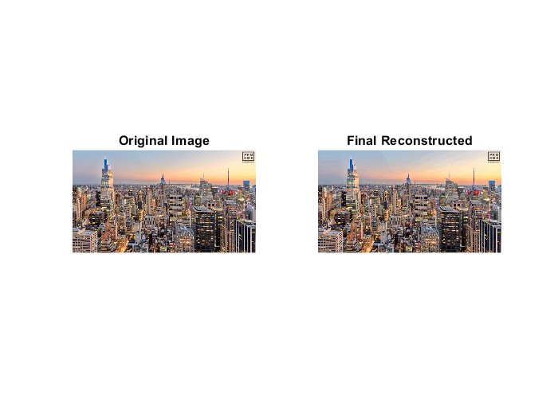

## Digital Adaptive Reconstruction and Transmission

This project demonstrates a MATLAB-based source coding and reconstruction pipeline for image transmission.

### Pipeline

#### 1. RGB Channel Separation
The original image is split into Red, Green, and Blue channels.

#### 2. Randomized Pixel Permutation (Obfuscation)
Each channel is shuffled using a dynamic seed to obfuscate the image.

#### 3. Huffman Source Coding
The shuffled image data is quantized and encoded using Huffman coding for compression.

#### 4. Decoding and Inverse Permutation
The data is decoded and inverse-shuffled to retrieve the channels.

#### 5. Image Reconstruction and Quality Evaluation
The image is reconstructed, and PSNR/SSIM metrics are calculated to evaluate quality.

### Notes
- Focuses on source coding and reconstruction
- No explicit channel noise model
- Near-lossless reconstruction depending on quantization factor
